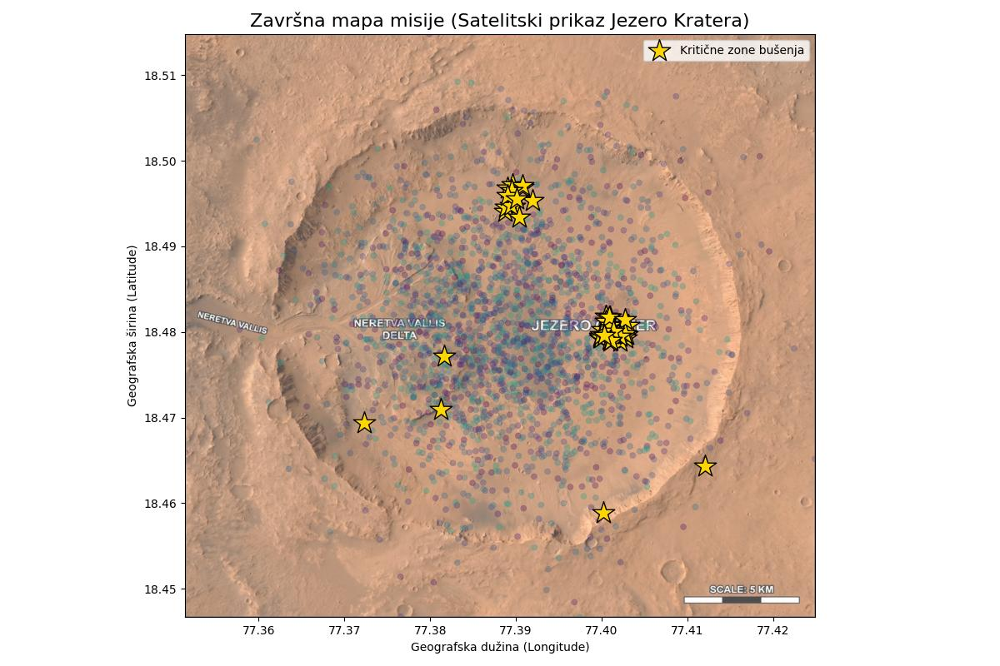

# Projekt Nexus: Analiza kratera Jezero i navigacija rovera

## Executive Summary

Projekt Nexus fokusiran je na analizu geoprostornih i geokemijskih podataka kratera Jezero na Marsu s ciljem razvoja automatiziranog navigacijskog sustava za istraživački rover.

Ulazni podaci uključuju telemetrijske zapise (lokacije, dubine, pH vrijednosti, koncentracije metana), dok je krajnji cilj generiranje preciznih navigacijskih naredbi koje omogućuju sigurnu i optimiziranu kretnju robota kroz teren.

---

## Struktura repozitorija

```bash
project-nexus/
│
├── data/        # Ulazni CSV podaci
│   ├── mars_lokacije.csv
│   └── mars_uzorci.csv
│
├── src/         # Python skripte
│   ├── zavrsna_simulacija.py
│
├── assets/      # Grafovi i vizualizacije
│   ├── graf_1_korelacija_(3).png
│   ├── graf_2_mapa_metana_(1).png
    ├── graf_4_usporedba_zona.png
    ├── graph2_heatmap_depth.png
    ├── graph5_jezero_mission_map.jpg
│   └── graph1_temp_h2o.png
│
└── README.md    # Dokumentacija projekta
```

---

## Metodologija obrade podataka (Data Wrangling)

Podaci su obrađeni korištenjem Python biblioteka:

* `pandas`
* `matplot`

### Ključni koraci:

1. **Učitavanje podataka**

```python
import pandas as pd

lokacije = pd.read_csv("data/mars_lokacije.csv")
uzorci = pd.read_csv("data/mars_uzorci.csv")
```

2. **Spajanje skupova podataka**

```python
df_spajanje = pd.merge(df_lokacije, df_uzorci, on='ID_Uzorka')
```

3. **Čišćenje podataka**

* uklanjanje ekstremnih vrijednosti
* filtriranje senzorskog šuma

```python
df_notemp = df_spajanje[df_spajanje['Temp_Tla_C'] != 150.0]
df_cisto = df_notemp[df_notemp['H2O_Postotak'].astype(str).str.len() < 6].copy()
df_cisto['H2O_Postotak'] = pd.to_numeric(df_cisto['H2O_Postotak'])
kandidati = df_cisto[(df_cisto['Metan_Senzor'] == 'Pozitivno') & (df_cisto['Organske_Molekule'] == 'Da')]
```

4. **Normalizacija i priprema za analizu**

---

## Geoprostorna analiza i vizualizacija

Analiza uključuje vizualnu interpretaciju ključnih parametara.

### Korelacija varijabli

.png)

Analiza pokazuje povezanost između odnosa temperature i vlažnosti na marsu.

---

### Toplinska mapa terena

.png)

Vizualizira koncentracije metana na marsu uz pomoć heatmapa.

---

### Satelitska mapa (GPS projekcija)



Korišten je koncept **extent mapiranja** za precizno pozicioniranje podataka na stvarne koordinate.

Ova metoda omogućuje:

* realističnu navigaciju
* precizno mapiranje terena
* optimizaciju putanje robota

---

## Komunikacijski protokol (JSON Uplink)

Navigacijske naredbe generiraju se u JSON formatu:

```json
 nalog = {
        "id_uzorka": int(redak['ID_Uzorka']),
        "koordinate": {
            "lat": float(redak['GPS_LAT']),
            "long": float(redak['GPS_LONG'])
        },
        "akcije": ["NAVIGACIJA", "SONDIRANJE", "SLANJE_PODATAKA"]
    }
```

### Automatizacija generiranja naredbi

Umjesto ručnog unosa koristi se petlja:

```python
paket = {
    "misija": "Nexus",
    "kandidati_count": len(nalozi_lista),
    "nalozi": nalozi_lista
}
```

Prednosti:

* skalabilnost
* smanjenje grešaka
* fleksibilnost sustava

---

## Inženjerski dnevnik (Troubleshooting Log)

### Problem 1: Neuspješno spajanje podataka

* **Uzrok:** pogrešan separator u CSV datoteci
* **Rješenje:** definiranje separatora pri učitavanju

```python
pd.read_csv("file.csv", sep=";")
```

---

### Problem 2: Rušenje skripte zbog tipova podataka

* **Uzrok:** string vrijednosti u numeričkim stupcima
* **Rješenje:** konverzija tipova

```python
df["temperatura"] = df["temperatura"].astype(float)
```

---

### Problem 3: Odbijen API zahtjev

* **Uzrok:** nedostajući autentifikacijski header
* **Rješenje:** dodavanje zaglavlja

```python
headers = {"Authorization": "Bearer TOKEN"}
```

---

##  Pokretanje projekta

### 1. Kloniranje repozitorija

```bash
git clone https://github.com/username/project-nexus.git
cd project-nexus
```

## Tehnologije

* Python 3.x
* pandas
* numpy
* matplotlib
* seaborn

---

## Buduća poboljšanja

* integracija s real-time API sustavom
* napredna AI navigacija
* optimizacija rute pomoću strojnog učenja

---

## Autor

Projekt razvijen u sklopu inženjerskog programa **Projekt Nexus - Lean Brcic**.

---

## Licenca

Ovaj projekt je otvorenog koda i dostupan pod MIT licencom
